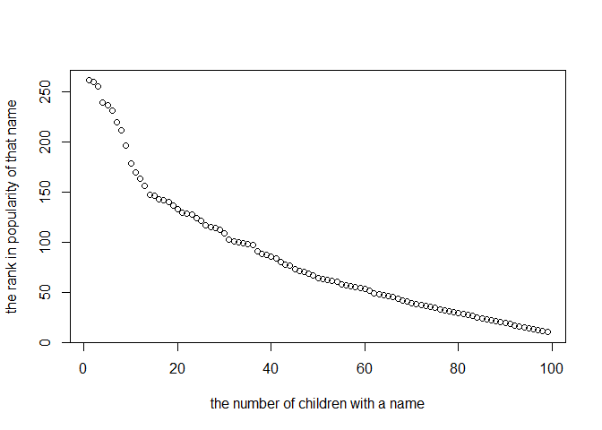

p8105\_hw2\_ww1234
================
Jason Wang
10/2/2019

# problem 1

\#\#load and clean data for Mr. Trash Wheel

``` r
## load in a dataset

trash_wheel_data = read_excel(path = "../data/Trash-Wheel-Collection-Totals-8-6-19.xlsx", 
                              sheet = "Mr. Trash Wheel",
                              range = cell_cols("A:N")
                              ) %>% 
  janitor::clean_names() %>% 
  na.omit() 
trash_wheel_data$sports_balls = round(as.integer(trash_wheel_data$sports_balls), digits = 0)

###checkpoints###
head(trash_wheel_data,5)
```

    ## # A tibble: 5 x 14
    ##   dumpster month  year date                weight_tons volume_cubic_ya~
    ##      <dbl> <chr> <dbl> <dttm>                    <dbl>            <dbl>
    ## 1        1 May    2014 2014-05-16 00:00:00        4.31               18
    ## 2        2 May    2014 2014-05-16 00:00:00        2.74               13
    ## 3        3 May    2014 2014-05-16 00:00:00        3.45               15
    ## 4        4 May    2014 2014-05-17 00:00:00        3.1                15
    ## 5        5 May    2014 2014-05-17 00:00:00        4.06               18
    ## # ... with 8 more variables: plastic_bottles <dbl>, polystyrene <dbl>,
    ## #   cigarette_butts <dbl>, glass_bottles <dbl>, grocery_bags <dbl>,
    ## #   chip_bags <dbl>, sports_balls <dbl>, homes_powered <dbl>

``` r
summary(trash_wheel_data)
```

    ##     dumpster         month                year     
    ##  Min.   :  1.00   Length:344         Min.   :2014  
    ##  1st Qu.: 86.75   Class :character   1st Qu.:2015  
    ##  Median :172.50   Mode  :character   Median :2017  
    ##  Mean   :172.50                      Mean   :2016  
    ##  3rd Qu.:258.25                      3rd Qu.:2018  
    ##  Max.   :344.00                      Max.   :2019  
    ##       date                      weight_tons    volume_cubic_yards
    ##  Min.   :2014-05-16 00:00:00   Min.   :0.960   Min.   : 7.00     
    ##  1st Qu.:2015-07-05 00:00:00   1st Qu.:2.757   1st Qu.:15.00     
    ##  Median :2017-03-31 00:00:00   Median :3.265   Median :15.00     
    ##  Mean   :2016-12-23 10:57:12   Mean   :3.263   Mean   :15.54     
    ##  3rd Qu.:2018-05-19 18:00:00   3rd Qu.:3.772   3rd Qu.:16.00     
    ##  Max.   :2019-06-17 00:00:00   Max.   :5.620   Max.   :20.00     
    ##  plastic_bottles   polystyrene   cigarette_butts  glass_bottles   
    ##  Min.   : 210.0   Min.   : 320   Min.   :   980   Min.   :  0.00  
    ##  1st Qu.: 957.5   1st Qu.:1065   1st Qu.:  7000   1st Qu.: 10.00  
    ##  Median :1835.0   Median :2075   Median : 19000   Median : 21.50  
    ##  Mean   :1873.2   Mean   :2139   Mean   : 30754   Mean   : 25.36  
    ##  3rd Qu.:2552.5   3rd Qu.:3120   3rd Qu.: 38000   3rd Qu.: 38.00  
    ##  Max.   :5960.0   Max.   :6540   Max.   :310000   Max.   :110.00  
    ##   grocery_bags    chip_bags       sports_balls   homes_powered  
    ##  Min.   :  50   Min.   : 230.0   Min.   : 0.00   Min.   : 0.00  
    ##  1st Qu.: 600   1st Qu.: 977.5   1st Qu.: 5.00   1st Qu.:35.62  
    ##  Median :1050   Median :1630.0   Median : 8.00   Median :51.42  
    ##  Mean   :1311   Mean   :1780.3   Mean   :11.79   Mean   :43.83  
    ##  3rd Qu.:1912   3rd Qu.:2490.0   3rd Qu.:16.00   3rd Qu.:59.50  
    ##  Max.   :3750   Max.   :5085.0   Max.   :56.00   Max.   :93.67

``` r
count(trash_wheel_data)
```

    ## # A tibble: 1 x 1
    ##       n
    ##   <int>
    ## 1   344

``` r
###checkend###
```

\#\#Read and clean precipitation data of 2017

``` r
##read and clean precipitation data of 2017
precipitation_dataset_2017 = read_excel(path = "../data/Trash-Wheel-Collection-Totals-8-6-19.xlsx",
                                        sheet = "2017 Precipitation",
                                        range = "A2:B14") %>% 
  na.omit() %>%
  janitor::clean_names() %>% 
mutate( year = '2017' )
 
####check points####
view(precipitation_dataset_2017)
summary(precipitation_dataset_2017)
```

    ##      month           total           year          
    ##  Min.   : 1.00   Min.   :0.000   Length:12         
    ##  1st Qu.: 3.75   1st Qu.:1.285   Class :character  
    ##  Median : 6.50   Median :2.145   Mode  :character  
    ##  Mean   : 6.50   Mean   :2.744                     
    ##  3rd Qu.: 9.25   3rd Qu.:4.103                     
    ##  Max.   :12.00   Max.   :7.090

``` r
count(precipitation_dataset_2017)
```

    ## # A tibble: 1 x 1
    ##       n
    ##   <int>
    ## 1    12

``` r
####checkend#####
```

\#\#read and clean precipitation data of
2018

``` r
precipitation_dataset_2018 = read_excel(path = "../data/Trash-Wheel-Collection-Totals-8-6-19.xlsx",
                                        sheet = "2018 Precipitation",
                                        range = "A2:B14") %>% 
  na.omit() %>% 
  janitor::clean_names() %>%
mutate( year = '2018' )

####check points####
view(precipitation_dataset_2018)
summary(precipitation_dataset_2018)
```

    ##      month           total            year          
    ##  Min.   : 1.00   Min.   : 0.940   Length:12         
    ##  1st Qu.: 3.75   1st Qu.: 4.190   Class :character  
    ##  Median : 6.50   Median : 5.455   Mode  :character  
    ##  Mean   : 6.50   Mean   : 5.861                     
    ##  3rd Qu.: 9.25   3rd Qu.: 8.182                     
    ##  Max.   :12.00   Max.   :10.470

``` r
####checkend#####
```

\#\#combination the two dataset of precipitation\_dataset\_2017 and
precipitation\_dataset\_2018

    ##     month                2017            2018       
    ##  Length:12          Min.   :0.000   Min.   : 0.940  
    ##  Class :character   1st Qu.:1.285   1st Qu.: 4.190  
    ##  Mode  :character   Median :2.145   Median : 5.455  
    ##                     Mean   :2.744   Mean   : 5.861  
    ##                     3rd Qu.:4.103   3rd Qu.: 8.182  
    ##                     Max.   :7.090   Max.   :10.470

the number of observation in 2017 is 12. the number of observation in
2018 is 12. the total precipitation in 2018 is 70.33.

Write a paragraph about these data; you are encouraged to use inline R.
Be sure to note the number of observations in both resulting datasets,
and give examples of key variables. For available data, what was the
total precipitation in 2018? What was the median number of sports balls
in a dumpster in 2017?

# problem 2

``` r
##load and clean data in pols-month.csv
pols_month_dataset = read_csv(file = "../data/pols-month.csv") %>%   ##load pols-month.csv
  janitor::clean_names() %>% ##clean the dataset
  separate(col = "mon", sep = "-", into = c("year", "month", "day"), 
           convert = type.convert("month", "year", "day" , 
                                  numerals = c("allow.loss"))) %>%  ##separate to year, month, day, and transfer month format "01" "02"... to "1", "2)
  transform(month = month.abb[month]) %>%   ##replace month number with month name
  mutate(president = case_when(
    prez_dem == 1 ~ "dem",
    prez_gop == 1 ~ "gop",
    TRUE ~ ""
  )) %>%  ##add variable president with value "dem" and "gop"
  select("year", "month", "gov_gop":"rep_gop", "gov_dem":"rep_dem", "president") ##remove prez_gop, prez_dem and day variable
```

    ## Parsed with column specification:
    ## cols(
    ##   mon = col_date(format = ""),
    ##   prez_gop = col_double(),
    ##   gov_gop = col_double(),
    ##   sen_gop = col_double(),
    ##   rep_gop = col_double(),
    ##   prez_dem = col_double(),
    ##   gov_dem = col_double(),
    ##   sen_dem = col_double(),
    ##   rep_dem = col_double()
    ## )

``` r
summary(pols_month_dataset)
```

    ##       year         month              gov_gop         sen_gop    
    ##  Min.   :1947   Length:822         Min.   :12.00   Min.   :32.0  
    ##  1st Qu.:1964   Class :character   1st Qu.:18.00   1st Qu.:42.0  
    ##  Median :1981   Mode  :character   Median :22.00   Median :46.0  
    ##  Mean   :1981                      Mean   :22.48   Mean   :46.1  
    ##  3rd Qu.:1998                      3rd Qu.:28.00   3rd Qu.:51.0  
    ##  Max.   :2015                      Max.   :34.00   Max.   :56.0  
    ##     rep_gop         gov_dem        sen_dem         rep_dem   
    ##  Min.   :141.0   Min.   :17.0   Min.   :44.00   Min.   :188  
    ##  1st Qu.:176.0   1st Qu.:22.0   1st Qu.:48.00   1st Qu.:211  
    ##  Median :195.0   Median :28.0   Median :53.00   Median :250  
    ##  Mean   :194.9   Mean   :27.2   Mean   :54.41   Mean   :245  
    ##  3rd Qu.:222.0   3rd Qu.:32.0   3rd Qu.:58.00   3rd Qu.:268  
    ##  Max.   :253.0   Max.   :41.0   Max.   :71.00   Max.   :301  
    ##   president        
    ##  Length:822        
    ##  Class :character  
    ##  Mode  :character  
    ##                    
    ##                    
    ## 

``` r
count(pols_month_dataset)
```

    ## # A tibble: 1 x 1
    ##       n
    ##   <int>
    ## 1   822

``` r
##load and clean data in snp.csv
snp_dataset = read_csv(file = "../data/snp.csv") %>% ##load the data
  janitor::clean_names() %>%                         ##clean the data
  separate(col = "date", 
           sep = "/", 
           into = c("month", "day", "year"), 
           convert = type.convert("month", "day", "year", 
                                  numerals = c("allow.loss"))) %>% 
  transform(month = month.abb[month]) %>%            ##separate the data
  select("year", "month", "day", everything()) 
```

    ## Parsed with column specification:
    ## cols(
    ##   date = col_character(),
    ##   close = col_double()
    ## )

``` r
##load and clean unemployment data
unemployment_dataset = read_csv(file = "../data/unemployment.csv") %>% 
  pivot_longer(
    Jan:Dec,
    names_to = "month",
    values_to = "unemployment"
  ) %>% 
  janitor::clean_names()
```

    ## Parsed with column specification:
    ## cols(
    ##   Year = col_double(),
    ##   Jan = col_double(),
    ##   Feb = col_double(),
    ##   Mar = col_double(),
    ##   Apr = col_double(),
    ##   May = col_double(),
    ##   Jun = col_double(),
    ##   Jul = col_double(),
    ##   Aug = col_double(),
    ##   Sep = col_double(),
    ##   Oct = col_double(),
    ##   Nov = col_double(),
    ##   Dec = col_double()
    ## )

``` r
## first merge the snp and pols dataset
merg_snp_pols_dataset = full_join(snp_dataset, pols_month_dataset, by = c("year", "month"))

merg_snp_pols_unem_dataset = left_join(merg_snp_pols_dataset, unemployment_dataset, by = c("year", "month"))
```

summary Write a short paragraph about these datasets. Explain briefly
what each dataset contained, and describe the resulting dataset
(e.g. give the dimension, range of years, and names of key variables).

# problem 3

``` r
#load and clean the data
popular_baby_name_dataset = read_csv(file = "../data/Popular_Baby_Names.csv") %>% 
  janitor::clean_names() %>% 
  distinct()
```

    ## Parsed with column specification:
    ## cols(
    ##   `Year of Birth` = col_double(),
    ##   Gender = col_character(),
    ##   Ethnicity = col_character(),
    ##   `Child's First Name` = col_character(),
    ##   Count = col_double(),
    ##   Rank = col_double()
    ## )

``` r
popular_male_baby_name_dataset = popular_baby_name_dataset %>% 
  filter(gender == "MALE") %>% 
  filter(ethnicity == "WHITE NON HISPANIC") %>% 
  filter(year_of_birth == 2016)
 
plot(popular_male_baby_name_dataset$rank, popular_male_baby_name_dataset$count,
     xlab = "the number of children with a name",
     ylab = "the rank in popularity of that name")
```

<!-- -->
